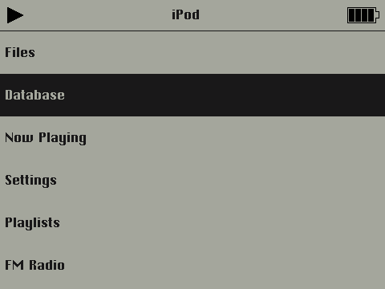
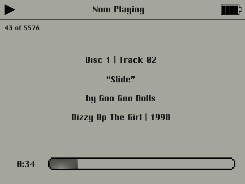

## 
PodOne Port for Innioasis Y1 (360p)

There aren't enough themes that take advantage of the full resolution of the Y1, and the 240p version of Rockbox is fine but themes on it look kind of bad on the 480x360 dispolay.
Here's a port of a theme I found and liked.

 

Original author: Guillaume Cocatre-Zilgien <gcocatre@gmail.com> 
Innioasis Y1 360p Port: <a href=https://github.com/AkikoKumagara>AkikoKumagara</a>

Fonts Contained: 
Nimbus